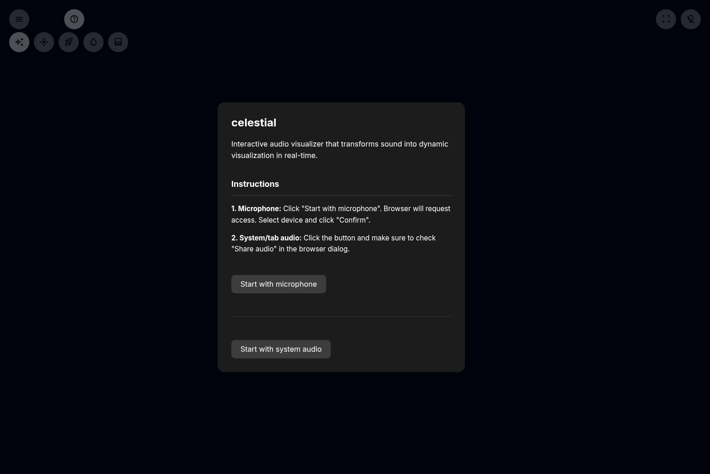

# ScreenSavy

**Transform any display into a beautiful ambient screen**

[](https://www.screensavy.com/)
[](LICENSE)
[](https://nextjs.org/)

**English** | [Русский](README.ru.md)

---

## 🎨 What is ScreenSavy?

ScreenSavy is a modern web application that transforms any display into a dynamic ambient screen. Whether you're setting the mood for a movie night, calibrating monitor colors, creating backgrounds for photography, or simply want a beautiful clock display, ScreenSavy provides an elegant, browser-based solution that works on any device.

**Live Demo:** [https://www.screensavy.com/](https://www.screensavy.com/)


---

## ✨ Features

### 🎨 Color Modes

**One Color Mode**
- Display any solid color across your entire screen
- Perfect for monitor calibration, ambient lighting, or color therapy
- RGB sliders with real-time preview
- HEX color input with copy functionality
- Shade variations for quick color exploration


**Color Transition Mode**
- Create smooth animated transitions between your favorite colors
- Adjustable transition speed (1-10 scale)
- Build custom color palettes
- Perfect for ambient lighting and mood setting

### 🕐 Clock Modes

Three beautiful clock styles to choose from:
- **Modern**: Clean, minimalist time display
- **Full**: Time with date and day of week
- **Minimal**: Ultra-simple time-only display

All clocks feature:
- Automatic locale detection
- 12/24 hour format support
- Smooth animations
- Customizable colors

### 📝 Text Mode

Create stunning typography displays for:
- Event signage
- Digital posters
- Lyric displays
- Workshop prompts
- Creative presentations

Features:
- 28 font options
- 3 size presets (small, medium, large)
- Text alignment controls
- Color customization
- Text stroke/outline effects
- Style presets (Neon, Classic, Minimal, Bold, Elegant)


### 🌌 Visualizers

**Audio-Reactive Visualizers** (require microphone or system audio):
- **Celestial Weaver**: Cosmic particle effects that respond to sound
- **Super Nova**: Explosive visual patterns synchronized with audio
- **Voyager**: Space-themed audio visualization

**Ambient Visualizers** (no audio required):
- **Lava Lamp**: Classic lava lamp simulation
- **RGB Lava**: Colorful lava lamp with dynamic hues



**Want to add your own visualizers?** Check out the [Custom Visualizers Guide](docs/CUSTOM_VISUALIZERS.md) to learn how to create and integrate your own visualizations.

### 💾 Favorites & Palettes

- Save unlimited favorite colors
- Quick access to saved palettes
- Export/import color collections
- Shade generator for color exploration
- Adjacent color suggestions

### 🌍 Multilingual Support

- **English** and **Russian** interfaces
- Automatic browser language detection
- Manual language toggle
- Localized date/time formatting

---

## 🚀 Quick Start

### Online Version

Simply visit [https://www.screensavy.com/](https://www.screensavy.com/) in any modern browser. No installation required!

### Portable Windows Version

Download the portable version from the [Releases page](https://github.com/timoncool/ScreenSavy.com/releases) for offline use:

1. Download `ScreenSavy-Portable-Windows.zip`
2. Extract to any folder
3. Double-click `start.bat`
4. Your browser opens automatically at `http://127.0.0.1:3000`

**Requirements:**
- Windows 7 or later
- 500 MB free disk space
- No internet connection required after extraction

---

## 💻 Development

### Prerequisites

- Node.js 18.17 or newer
- npm 9 or newer

### Installation

```bash
# Clone the repository
git clone https://github.com/timoncool/ScreenSavy.com.git
cd ScreenSavy.com

# Install dependencies
npm install
```

### Development Server

```bash
npm run dev
```

Open [http://localhost:3000](http://localhost:3000) in your browser.

### Production Build

```bash
npm run build
npm start
```

### Linting

```bash
npm run lint
```

---

## 📁 Project Structure

```
ScreenSavy.com/
├── app/                          # Next.js App Router
│   ├── layout.tsx               # Root layout with metadata
│   ├── page.tsx                 # Main page (color modes)
│   └── modes/
│       ├── text/page.tsx        # Text mode
│       └── visualizers/         # Visualizer routes
│           ├── celestial/
│           ├── supernova/
│           ├── voyager/
│           ├── lava-lamp/
│           └── rgb-lava/
├── src/
│   ├── components/screensavy/
│   │   ├── MainExperience.tsx      # Main app component
│   │   ├── TextModeExperience.tsx  # Text mode component
│   │   ├── VisualizersCatalog.tsx  # Visualizer browser
│   │   ├── VisualizerDetail.tsx    # Visualizer display
│   │   ├── shared.tsx              # Shared UI components
│   │   ├── translations.ts         # i18n strings
│   │   └── textTranslations.ts     # Text mode i18n
│   └── lib/
│       ├── color.ts              # Color utilities
│       └── visualizers.ts        # Visualizer metadata
├── public/
│   └── visualizers/             # Visualizer HTML files
│       ├── CELESTIAL.html
│       ├── SUPER_NOVA.html
│       ├── Final_RGB_lava.html
│       └── optimized-lava-lamp.html
└── docs/
    ├── screenshots/             # Documentation images
    └── CUSTOM_VISUALIZERS.md    # Guide for adding visualizers
```

---

## 🎯 Use Cases

ScreenSavy is perfect for:

- **Home Theater**: Set ambient lighting for movie nights
- **Photography**: Create colored backgrounds for photo/video shoots
- **Design Work**: Monitor calibration and color palette testing
- **Events**: Digital signage and informational displays
- **Workspaces**: Ambient lighting and focus timers
- **Hospitality**: Mood lighting for restaurants, hotels, studios
- **Education**: Visual aids for classrooms and presentations

---

## 🛠️ Technology Stack

- **Framework**: Next.js 14 with React 18
- **Styling**: Tailwind CSS + custom CSS
- **Language**: TypeScript
- **State Management**: React hooks + localStorage
- **Rendering**: Client-side with static generation
- **Internationalization**: Built-in Russian/English support

---

## 🤝 Contributing

We welcome contributions! Here's how you can help:

### Ways to Contribute

- **New Visualizers**: Create audio or ambient visualizations ([guide](docs/CUSTOM_VISUALIZERS.md))
- **UI/UX**: Enhance existing modes or add new features
- **Translations**: Add support for new languages
- **Performance**: Optimize rendering and animations
- **Documentation**: Improve guides and tutorials
- **Bug Fixes**: Help identify and resolve issues

### Contribution Guidelines

1. Fork the repository
2. Create a feature branch from `main`
3. Make your changes
4. Run `npm run lint` to ensure code quality
5. Test across different browsers and screen sizes
6. Submit a pull request with clear description
7. Include screenshots for UI changes

### Code Style

- Follow existing code patterns
- Use meaningful variable names
- Add comments for complex logic
- Ensure all modes work after changes
- Test on multiple screen sizes

---

## 🗺️ Roadmap

### Planned Features

- **Gradient Modes**: Multi-color gradients with customizable directions
- **Particle Systems**: Interactive particle effects
- **Scheduling**: Automated scene changes and timers
- **Remote Control**: Control from mobile devices
- **Advanced Typography**: Lyric video presets and animations
- **Accessibility**: Enhanced keyboard navigation and ARIA support
- **Custom Visualizers**: Upload your own HTML/JS visualizations
- **Export**: Save screenshots and video recordings
- **Themes**: Pre-built color schemes and style packs

---

## 📦 Portable Release

The portable Windows version includes:
- Portable Node.js v20.11.0
- Pre-built production bundle
- All dependencies (node_modules)
- Automatic setup scripts

**Scripts:**
- `start.bat`: Launch the application
- `update.bat`: Update to latest version

The portable version works completely offline after extraction and requires no installation.

---

## 📄 License

This project is open-source and available under the [MIT License](LICENSE).

---

## 🔗 Links

- **Live Demo**: [https://www.screensavy.com/](https://www.screensavy.com/)
- **GitHub**: [https://github.com/timoncool/ScreenSavy.com](https://github.com/timoncool/ScreenSavy.com)
- **Releases**: [https://github.com/timoncool/ScreenSavy.com/releases](https://github.com/timoncool/ScreenSavy.com/releases)
- **ProductRadar**: [https://productradar.ru/product/screensavy-com/](https://productradar.ru/product/screensavy-com/)

---

## 💖 Support

If you find ScreenSavy useful, please:
- ⭐ Star the repository
- 🐛 Report bugs and suggest features via [Issues](https://github.com/timoncool/ScreenSavy.com/issues)
- 📢 Share with others who might find it useful
- 👍 Endorse on [ProductRadar](https://productradar.ru/product/screensavy-com/)

---

Made with ❤️ for creators, designers, and everyone who appreciates beautiful ambient screens.
